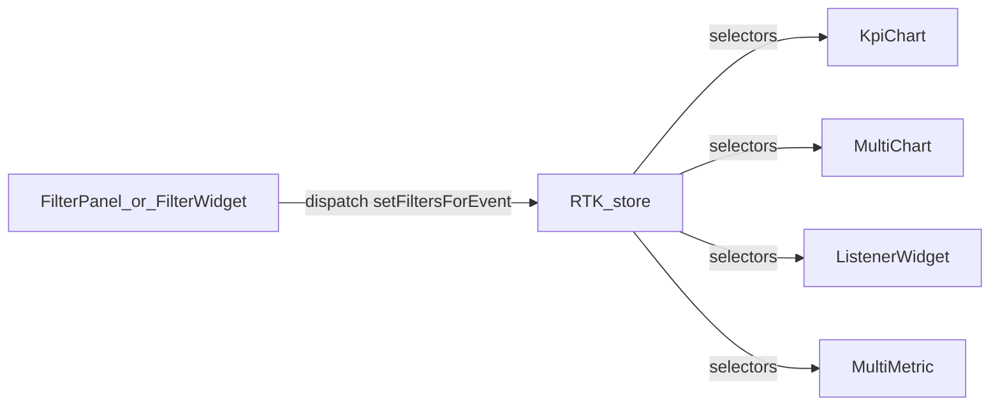

## Goals

- Use **Redux Toolkit as the single source of truth** for shared, cross-component state.
- **Replace** `src/services/EventBus.ts` publish/subscribe with RTK-driven “event channels” so widgets react to store updates instead of ad-hoc callbacks.
- **Centralize dashboard builder/editor state** (widgets/layout, selection, view-mode, undo/redo, copy/paste) in RTK.

## Current state (what’s already there)

- RTK store exists and is wired via `Provider` in `[src/lib/providers.tsx](src/lib/providers.tsx)`.
- A single slice exists: `[src/store/filterSlice.ts](src/store/filterSlice.ts)`, mounted as `filters` in `[src/store/store.ts](src/store/store.ts)`.
- Some widgets already read filters from RTK (e.g. KPI chart reads `state.filters` and matches `listenToEvent`): `[src/widgets/chart/kpi-chart/KpiChart.tsx](src/widgets/chart/kpi-chart/KpiChart.tsx)`.
- Some widgets still use `EventBus` for communication (e.g. `FilterWidget` publishes; `ListenerWidget` subscribes): `[src/widgets/FilterWidget.tsx](src/widgets/FilterWidget.tsx)`, `[src/widgets/ListenerWidget.tsx](src/widgets/ListenerWidget.tsx)`.
- Dashboard builder/editor is currently local state (selection/view mode/history/etc.) in `[src/features/dashboard/builder/DashboardBuilder.tsx](src/features/dashboard/builder/DashboardBuilder.tsx)`.

## Target architecture

### Replace EventBus with “event channels” in RTK

- Create a new slice (or refactor the existing one) to store **filter/event payloads keyed by `eventName**`.
- Each update should include an `updatedAt` (or incrementing `version`) so listeners can react predictably.

Suggested state shape:

- `filters.byEventName[eventName] = { variables: Record<string, FilterValue>, rawPayload?: any, updatedAt: number }`

Suggested selectors:

- `selectFilterChannel(eventName)` → returns channel object
- `selectVariablesForEvent(eventName)` → returns `variables`
- `selectVariableQueryStringForEvent(eventName)` → uses existing `buildVariableParams` (`src/utils/buildVariableParams.ts`) for BEX queries

### Centralize dashboard builder/editor state in RTK

- Add a `dashboardBuilder` slice that owns:
  - `widgets`, `layout`
  - `selectedWidgetId`
  - `isViewMode`
  - `clipboard` (copied widget + layout)
  - `history` and `future` stacks for undo/redo

Suggested reducers (high-level):

- `selectWidget(id|null)`, `setViewMode(boolean)`
- `addWidget(widgetName)`, `removeWidget(id)`
- `updateWidgetProps({id, props})`
- `setLayout(layout)`, `setWidgets(widgets)`
- `undo()`, `redo()`
- `copySelected()`, `pasteCopied()`

### Data fetching stays in React Query

- Keep `useBexJson` (React Query) as-is; RTK provides the **variables** to it.

## Data flow (post-change)

## Implementation steps (files to touch)

1. **Refactor filters slice into channel-based state**

- Update `[src/store/filterSlice.ts](src/store/filterSlice.ts)` to support multiple `eventName` channels (keyed map).
- Update usage in:
  - `[src/widgets/filter-panel/FilterPanel.tsx](src/widgets/filter-panel/FilterPanel.tsx)` to dispatch `setFiltersForEvent({ eventName, variables })`.
  - `[src/widgets/FilterWidget.tsx](src/widgets/FilterWidget.tsx)` to dispatch instead of `eventBus.publish(...)`.
  - `[src/widgets/ListenerWidget.tsx](src/widgets/ListenerWidget.tsx)` to remove `eventBus.subscribe(...)` and instead `useAppSelector(selectFilterChannel(listenToEvent))` + `useEffect` to refetch on `updatedAt` changes.
  - `[src/widgets/chart/multi-metric/MultiMetric.tsx](src/widgets/chart/multi-metric/MultiMetric.tsx)` similarly for per-metric `listenToEvent`.
  - `[src/widgets/chart/kpi-chart/KpiChart.tsx](src/widgets/chart/kpi-chart/KpiChart.tsx)` and `[src/widgets/chart/multi-chart/MultiChart.tsx](src/widgets/chart/multi-chart/MultiChart.tsx)` to read from `filters.byEventName[listenToEvent]` instead of a single `filters.eventName`.

1. **Remove EventBus usage**

- Delete `[src/services/EventBus.ts](src/services/EventBus.ts)` and remove all imports.
- Ensure no lingering publish/subscribe references remain.

1. **Add `dashboardBuilder` slice and move builder state into RTK**

- Add `src/store/dashboardBuilderSlice.ts` and register it in `[src/store/store.ts](src/store/store.ts)`.
- Refactor `[src/features/dashboard/builder/DashboardBuilder.tsx](src/features/dashboard/builder/DashboardBuilder.tsx)` to:
  - derive `widgets/layout/selection/viewMode/history/future` from RTK via selectors
  - dispatch actions for add/remove/update/undo/redo/copy/paste
- Update `[src/components/WidgetConfigurationPanel.tsx](src/components/WidgetConfigurationPanel.tsx)` and related builder UI to read/write the same RTK state rather than passing `widgets`/`selectedWidget` props around.

1. **(Optional, if useful) Persist builder state**

- If you want builder state to survive refresh/navigation, add a simple persistence layer (e.g., serialize `dashboardBuilder` to localStorage in a client-only effect). Keep this optional to avoid scope creep.

1. **Verification**

- Compile TypeScript and run the app.
- Manually verify:
  - FilterPanel/FilterWidget updates cause KPI/MultiChart/Listener/MultiMetric to refresh without EventBus.
  - DashboardBuilder: add/remove/update widget, undo/redo, copy/paste, select widget, toggle view/edit mode.

## Risks / gotchas to handle

- **Multiple filter panels**: channel-based `byEventName` avoids the current “single active eventName” limitation.
- **Undo/redo size**: history stacks can grow; cap history length (e.g., last 50 actions) in reducers to avoid memory bloat.
- **Serializability**: keep slice state plain JSON (no class instances, no functions).

